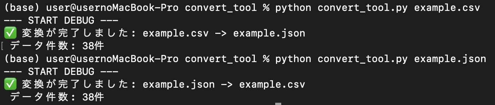

# CSV/JSON 相互変換ツール
このツールは、Pythonの標準ライブラリ（csv および json）のみを使用して作成された、コマンドラインベースのCSVとJSONの相互変換ユーティリティです。

## 📸 デモンストレーション
 

---

## 🧐 開発背景
現代のデータ処理において、CSVとJSONは最も広く使われる2つの形式です。しかし、それぞれ以下のような用途の違いがあります。

1. CSV (Comma-Separated Values)：
  * データベースやスプレッドシートなど、表形式のデータ交換に適しています。
  * Excelなどの表計算ソフトで直接開いて編集・確認するのに便利です。
   
2. JSON (JavaScript Object Notation)：
  * Web APIやプログラミング言語間でデータをやり取りする際に標準的に使用されます。
  * 入れ子構造や複雑なデータ型を扱うことができ、機械処理に適しています。

多くの場合、開発者は「APIから取得したJSONデータを分析のためにCSVに変換したい」あるいは「スプレッドシートで管理しているCSVデータをAPI連携のためにJSONに変換したい」という、形式の壁に直面します。このツールは、その変換を簡単かつ信頼性の高い方法で実現します。

---

## 🚀 主な機能
* 双方向変換: .csv から .json へ、または .json から .csv への変換を自動で判断し実行します。
* 堅牢なエラー処理: ファイルの存在チェック、サポート外形式のチェック、JSON構造の妥当性検証を行います。
* 依存関係ゼロ: Pythonの標準機能のみで動作するため、pip install による外部ライブラリのインストールは一切不要です。

---

## 💻 実行方法
1. Pythonコードを convert_tool.py という名前で保存します。
2. ターミナルまたはコマンドプロンプトで、変換したいファイルを引数として指定し実行します。
   * CSVからJSONへ変換: python convert_tool.py example.csv
   * JSONからCSVへ変換: python convert_tool.py example.json

----- **English Version** -----

# CSV/JSON Bi-directional Converter
This tool is a command-line utility for bi-directional conversion between CSV and JSON files, built exclusively using Python's standard libraries (csv and json).

## 📸 Demonstration
 

---

## 🧐 Development Background
In modern data processing, CSV and JSON are the two most widely used formats. However, their applications differ significantly:

1. CSV (Comma-Separated Values):
  * Ideal for exchanging tabular data (e.g., databases and spreadsheets).
  * Convenient for direct viewing, editing, and confirmation in applications like Excel.

2. JSON (JavaScript Object Notation):
  * The standard format for data exchange between Web APIs and programming languages.
  * Suitable for handling nested structures and complex data types, making it ideal for machine processing.

Developers often face a "format barrier," needing to convert JSON data obtained from an API for analysis into CSV, or converting management data in CSV to JSON for API integration. This tool was developed to handle this conversion easily and reliably.

---

## 🚀 Key Features
* Bi-directional Conversion: Automatically detects and executes conversion from .csv to .json or .json to .csv.
* Robust Error Handling: Includes file existence checks, unsupported format checks, and JSON structure validation.
* Zero Dependencies: Operates purely on Python's standard features, requiring absolutely no external library installation (pip install is unnecessary).

---

## 💻 How to Run
1. Save the Python code as convert_tool.py.
2. Run the script from your terminal or command prompt, specifying the file you wish to convert as an argument.
  * Convert CSV to JSON: python convert_tool.py example.csv
  * Convert JSON to CSV: python convert_tool.py example.json
